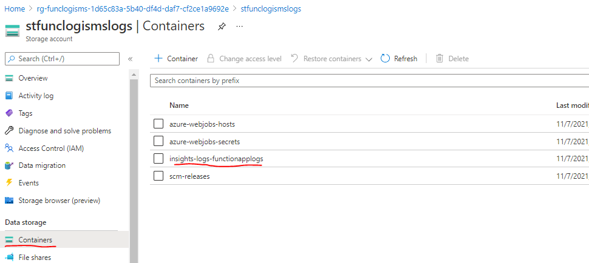
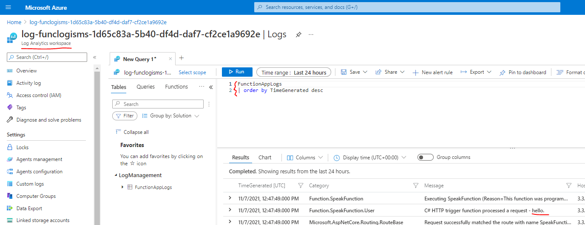

# log-isms
An experiment with Terraform, Azure Functions and Log Analytics

## Implementations
There is one implementations:

| Implementation | Folder |
| -------------- | ------ |
| MyCSharpFunctionApp  | An experiment with Terraform, Azure Functions (Linux Consumption), Log Analytics |

# Getting started
To create the resources using Terraform, add your SubscriptionID to variables.tf and then:

```
cd infra
terraform init
terraform apply
```

## MyCSharpFunctionApp
A Linux Function App (Consumption) that is configured via host.json to log Debug level messages to Log Analytics. 

Deploy the Function using Visual Studio: right click the function, 'Publish' and create a new publish profile. 

After publishing, navigate to the host and say a few words:

```
https://...thefunctionhost../api/speak/howdi
https://...thefunctionhost../api/speak/hello
```

It can take several minutes for the logs to appear. 

### Logging
host.json contains the default log levels. Currently set to: Debug

## Logs captured 
After publishing the AppService to Azure, the following logs are available:

### FunctionAppLogs and Archives (Storage)
The Terraform stack is configured to add the Diagnostics Settings to write FunctionAppLogs to the Log Analytics workspace and to Archive the FunctionAllLogs to the Storage Account.

After starting the AppService, look in the storage account to find the FunctionAppLogs Archive logs:



### Log Analytics Workspace
By default, just issue a query for FunctionAppLogs:


