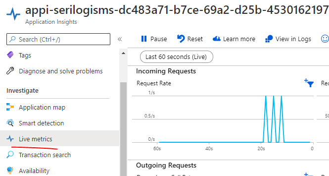
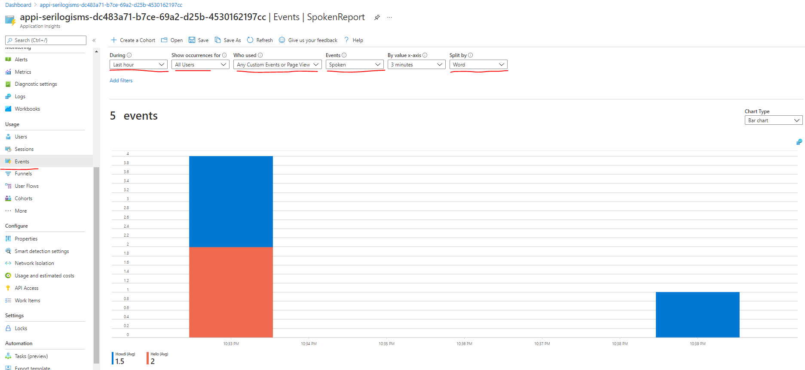

# log-isms
An experiment with Terraform, Serilog/.Net 5, Azure Monitoring, Log Analytics, AppInsights, AppServices and Diagnostics. 

After deploying this AppService, you will be able see the logs in storage and view them in Log Analytics:


## Getting started
To create the resources using Terraform, add your SubscriptionID to variables.tf and then:

```
terraform apply
```

Deploy the AppService using Visual Studio: right click the MvcApp, 'Publish' and create a new publish profile. 

## MyLinuxMvcAppService
A Linux AppService that shows using various Serilog providers and publishing custom events to AppInsights. 

### SERILOG_PROFILE_NAME
The 'logging profile' to use for Serilog is specified with the SERILOG_PROFILE_NAME variable: by default, no Serilog settings are loaded. 'Local' and 'Development' are provided as an examples as 'serilogSettings.Local.json' and 'serilogSettings.Development.json'. See 'launchSettings.json' for examples. 

### F5 Experience
To output to the Debug window in Visual Studio via Serilog, you must configure the Trace provider. This is specified in the 'Local' profile. 

### Customize or override single Serilog settings
The default .Net Environment Variable Provider is used to support overriding individual values - such as MinimumalLevel. See 'launchSettings.json' for examples suchas SERILOGSETTINGS_SERILOG__MINIMUMLEVEL=Debug

## Logs captured 
After publishing the AppService to Azure, the following logs are available:

### Console, Http and Platform logs are captured
Terraform is configured to add the Diagnostics Settings to write ConsoleLogs, HttpLogs and PlatformLogs to a storage account:

After starting the AppService, look in the storage account to find the console logs:


### Log Analytics Workspace
The 'Development' profile will publish logs to Azure Analytics in a custom log. 

It takes some time (in my case: around 1 hour) for my custom log called 'MvcApp_CL' to turn up in the Log Analytics workspace. But assuming it DOES exist, you can view and query the logs as follows:


## AppInsights
A minimalistic AppInsights implementation. 

Smoke test: Once deployed to Azure, navigate between Home and Privacy in the App while looking at the Live Metrics view (Incoming Requests) in Application Insights:



### Custom Events
Two endpoints have been created that publish a 'Spoken' event with a word of 'Hello' or 'Howdi'. Navigate to these endpoints in your browser to publish an event:

```
https://as-serilogisms-....azurewebsites.net/howdi
https://as-serilogisms-....azurewebsites.net/hello
```

The number of custom events published will (eventually) turn up in AppInsights (this took around 10-20 minutes initially):



# References
| Link | Description | 
| ---- | ----------- | 
| https://carldesouza.com/how-to-create-custom-events-metrics-traces-in-azure-application-insights-using-c/ | Creating custom events, metrics and traces in App Insights |
| https://codewithmukesh.com/blog/serilog-in-aspnet-core-3-1/ | Setting up Serilog with 3.1 |
| https://docs.microsoft.com/en-us/aspnet/core/fundamentals/configuration/?view=aspnetcore-5.0 |Environment variable / configuration providers | 
| https://github.com/saleem-mirza/serilog-sinks-azure-analytics | The Log Analytics Sink / Provider |
| https://docs.microsoft.com/en-us/azure/azure-monitor/app/asp-net-core | AppInsights | 
